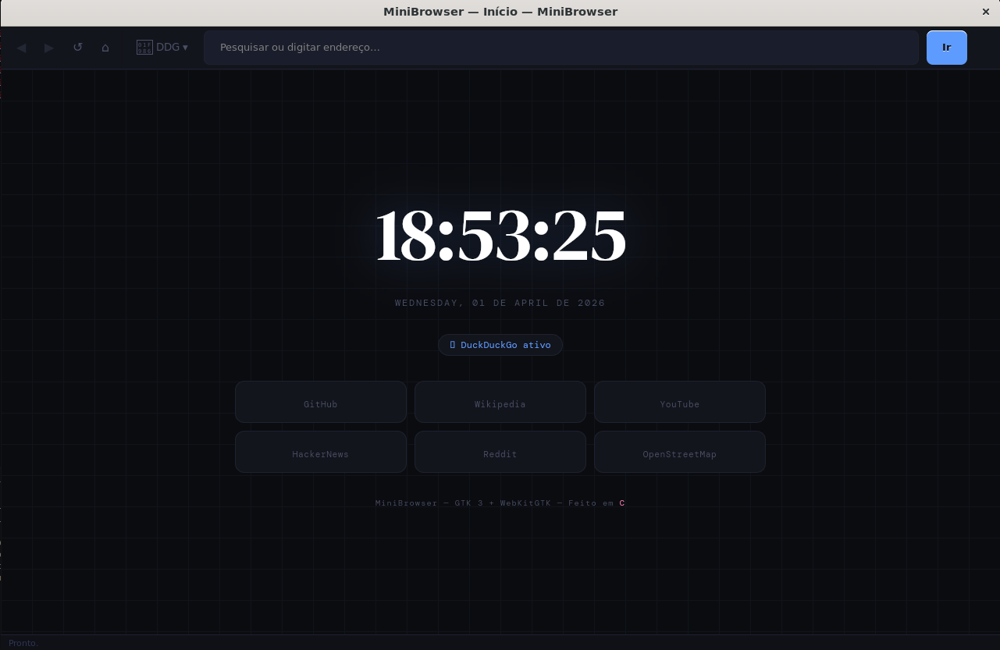

# MiniBrowser — Navegador Web Minimalista em C

Um navegador web leve e rápido construído com GTK3 e WebKitGTK, focado em simplicidade e desempenho. Desenvolvido inteiramente em C, oferece uma experiência de navegação fluida com recursos essenciais e interface limpa.

> Esse projeto é basicamente um side project meu feito no tempo entre o desenvolvimento 
> de um outro projeto maior que venho desenvolvendo há alguns meses >w<

<p align="center">
  
</p>

## Funcionalidades

- **Navegação básica**: Voltar, avançar, recarregar e página inicial
- **Barra de endereços inteligente**: Reconhecimento automático entre URLs e buscas
- **Múltiplos motores de busca**: DuckDuckGo, Google, Bing e Brave Search
- **Homepage personalizada**: Design dark com relógio ao vivo, atalhos e badge do motor ativo
- **Interface responsiva**: Throttling de atualizações para máximo desempenho
- **Cache otimizado**: Página inicial estática com injeção dinâmica via JavaScript
- **Tema escuro moderno**: Design editorial com animações suaves

## Compilação

### Pré-requisitos (Ubuntu/Debian)

```bash
sudo apt-get update
sudo apt-get install -y \
    build-essential \
    libgtk-3-dev \
    libwebkit2gtk-4.1-dev \
    pkg-config
```

### Compilando

```bash
make
```

### Executando

```bash
# Abre a página inicial
./minibrowser

# Abre uma URL específica
./minibrowser https://github.com

# Executa com recriação automática
make run
```

## Estrutura do Projeto

```
.
├── app.h           # Estrutura central da aplicação
├── main.c          # Ponto de entrada
├── ui.c / ui.h     # Construção da interface GTK
├── browser.c / browser.h  # Lógica de navegação
├── search.c / search.h    # Motor de busca
├── homepage.c / homepage.h # Gerador da página inicial
├── Makefile        # Script de compilação
├── setup.sh        # Script de instalação de dependências
└── README.md       # Este arquivo
```

## Tecnologias Utilizadas

- **C (C11)**: Linguagem principal
- **GTK+ 3.0**: Interface gráfica
- **WebKitGTK 4.1**: Motor de renderização
- **GLib**: Utilitários de string e estrutura de dados
- **JavaScript**