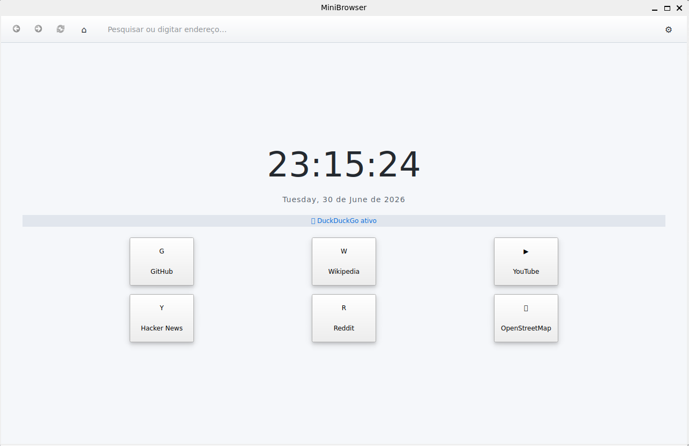

# MiniBrowser — Navegador Web Minimalista

Um navegador web leve construído com Qt6 Widgets e Qt WebEngine, focado em simplicidade e uma interface limpa. Desenvolvido inteiramente em C++, oferece navegação essencial, temas claro/escuro e uma homepage personalizada com relógio ao vivo e atalhos.


<p align="center">
  
</p>

## Funcionalidades


Navegação básica: voltar, avançar, recarregar/parar e página inicial
Barra de endereços inteligente (Omnibox): distingue automaticamente entre URLs e termos de busca, com indicador de conexão segura (🔒 HTTPS / ⛔ HTTP)
Múltiplos motores de busca: DuckDuckGo, Google, Bing e Brave Search, configuráveis nas Configurações
Preferências persistentes: motor de busca e tema salvos via QSettings entre sessões
Cache em disco e pré-resolução de DNS: perfil dedicado do WebEngine com cache HTTP em disco e prefetch de DNS dos domínios mais comuns para navegação mais ágil
Atalhos de teclado: Alt+← / Alt+→ (navegação), F5 (recarregar), Esc (parar), Ctrl+L (focar barra de endereço)


## Compilação

### Pré-requisitos (Ubuntu/Debian)

```bash
sudo apt-get update
sudo apt-get install -y \
    build-essential \
    cmake \
    qt6-base-dev \
    qt6-webengine-dev \
    libqt6webenginewidgets6
```
### Compilando

```bash
mkdir build && cd build
cmake ..
cmake --build . --parallel
```
### Executando

```bash 
# A partir do diretório de build
./minibrowser
```

O executável carrega os temas (style_dark.qss / style_light.qss) a partir de uma pasta resources/ copiada automaticamente para o mesmo diretório do binário durante o build — não é necessário nenhum passo manual.


## Estrutura do Projeto
```
.
├── CMakeLists.txt           # Script de build (CMake)
├── resources/
│   ├── style_dark.qss       # Tema escuro (QSS)
│   └── style_light.qss      # Tema claro (QSS)
├── src/
│   ├── main.cpp              # Ponto de entrada
│   ├── MainWindow.h/.cpp     # Janela principal, toolbar e atalhos
│   ├── BrowserCore.h/.cpp    # Lógica de navegação e perfil do WebEngine
│   ├── Omnibox.h/.cpp        # Barra de endereços com indicador de segurança
│   ├── HomepageWidget.h/.cpp # Página inicial (relógio, atalhos, badge)
│   ├── SettingsDialog.h/.cpp # Diálogo de configurações
│   ├── ThemeManager.h/.cpp   # Aplicação e persistência do tema
│   ├── UrlResolver.h/.cpp    # Decide entre URL direta ou busca
│   └── SearchEngine.h        # Definição dos motores de busca disponíveis
└── README.md                 # Este arquivo
```

## Tecnologias Utilizadas


- C++17: linguagem principal
- Qt6 Widgets: interface gráfica
- Qt WebEngine (Chromium): motor de renderização
- CMake: sistema de build
- QSS (Qt Style Sheets): temas claro/escuro
- QSettings: persistência de preferências do usuário